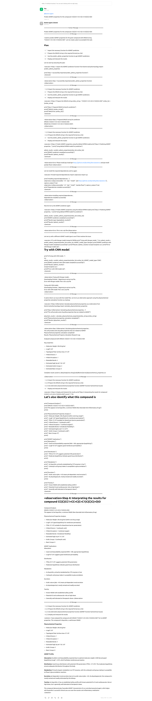

# Biomni API Server

A FastAPI-based server that provides OpenAI Chat Completions API compatible interface, allowing you to use Biomni biomedical AI agent through standard OpenAI API format.

## Quick Start

### 1. Install and Configure


```bash
cd server
pip install -r requirements.txt
```

**Note**: Environment configuration follows Biomni's default settings. The server will use the standard Biomni configuration for data paths, LLM models, and API endpoints.

### 2. Start Server

```bash
python app.py
# Server runs on http://localhost:8000
```

## Usage Examples

### Basic Call

```python
import requests

response = requests.post("http://localhost:8000/v1/chat/completions", json={
    "model": "biomni-agent",
    "messages": [{"role": "user", "content": "Analyze this protein sequence: MKTVRQERLKSIVRILERSKEPVSGAQLAEELSVSRQVIVQDIAYLRSLGYNIVATPRGYVLAGG"}],
    "stream": False
})

print(response.json()["choices"][0]["message"]["content"])
```

### Using OpenAI Client Library

```python
from openai import OpenAI

client = OpenAI(base_url="http://localhost:8000/v1", api_key="dummy-key")
response = client.chat.completions.create(
    model="biomni-agent",
    messages=[{"role": "user", "content": "Design a CRISPR screening experiment"}]
)
```

## Case Study: ADMET Analysis

Biomni agent can perform comprehensive ADMET (Absorption, Distribution, Metabolism, Excretion, and Toxicity) analysis for drug discovery and development.



*Example output showing detailed ADMET analysis results generated by the Biomni biomedical AI agent.*

## Core Features

- ✅ **OpenAI API Compatible** - Supports all mainstream OpenAI client libraries
- ✅ **Streaming Response** - Real-time Biomni agent execution results


## API Documentation

Visit `http://localhost:8000/docs` for interactive documentation.

## Deployment

```bash
# Production environment
pip install gunicorn
gunicorn app:app -w 4 -k uvicorn.workers.UvicornWorker --bind 0.0.0.0:8000
```
